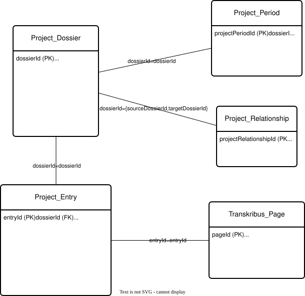

Migrate the relational database to a reduced data model as the basis for a graph
==============

This document describes how content from the relational project database was transferred to a reduced database schema. The reduced database schema was used to transform the data into a graph.

Further information on the relational database can be found at https://github.com/history-unibas/economies-of-space-database.


# Selection of entities and attributes for reduced database schema

The Geo_Address entity is not used in the reduced database schema.

## StABS_Serie
This entity is not used in the reduced database schema.

| **Column name** | **In Graph DB?** | **Remark**| 
|---------------|---------------|---------------|
| serieId | no | PRIMARY KEY |
| stabsId | no |  |
| title | no |  |
| linkRecord | no |  |

## StABS_Dossier
This entity is not used in the reduced database schema. Required attributes are incorporated into the Project_Dossier and Transkribus_Page entities.

| **Column name** | **In Graph DB?** | **Remark**| 
|---------------|---------------|---------------|
| dossierId | no | PRIMARY KEY	|
| serieId | no | FOREIGN KEY |
| stabsId | yes |  |
| title | no |  |
| linkRecord | yes |  |
| linkInstantiation | no |  |
| linkManifest | no |  |
| linkViewer | no |  |
| houseName | no |  |
| oldHousenumber | no |  |
| owner1862 | no |  |
| descriptivenote | no |  |

## StABS_Page
This entity is not used in the reduced database schema.

| **Column name** | **In Graph DB?** | **Remark**| 
|---------------|---------------|---------------|
| pageId | no | PRIMARY KEY	|
| dossierId | no | FOREIGN KEY |
| pageNr | no |  |
| linkViewer | no |  |

## Project_Dossier

| **Column name** | **In Graph DB?** | **Remark**| 
|---------------|---------------|---------------|
| dossierId | yes | PRIMARY KEY |
| locationUncorrectedAccuracy | yes |  |
| locationUncorrectedOrigin | yes |  |
| locationUncorrected<span style="color:red;">_{wgs84, lv95}**</span> | yes | <span style="color:red;">- WGS 84 (EPSG:4326) und LV95 (EPSG:2056) <br>- stored as a string (not of the 'geometry' data type)<br>- Schema WGS84: "<http://www.opengis.net/def/crs/EPSG/0/4326> POINT (47.55514 7.58963)"<br>- Schema LV95: "<http://www.opengis.net/def/crs/EPSG/0/2056> Point(2611362.373451764 1267128.0894856066)"**<br>- Source: https://docs.ogc.org/is/22-047r1/22-047r1.html#_877a702f-f4d3-464c-81e9-d8a1f37a13f5</span> |
| location<span style="color:red;">_{wgs84, lv95}</span> | yes | <span style="color:red;">dito locationUncorrected</span> |
| locationOrigin | yes |  |
| specialType | yes |  |
| <span style="color:red;">StABS_Dossier.stabsId</span> | <span style="color:red;">yes</span> | <span style="color:red;"></span> |
| <span style="color:red;">StABS_Dossier.linkRecord</span> | <span style="color:red;">yes</span> | <span style="color:red;"></span> |

## Project_Entry

| **Column name** | **In Graph DB?** | **Remark**| 
|---------------|---------------|---------------|
| entryId | yes | PRIMARY KEY |
| dossierId | yes | FOREIGN KEY (Project_Dossier.dossierId)|
| pageId | no | FOREIGN KEY (List) |
| year | yes |  |
| yearSource | no | FOREIGN KEY |
| comment | yes |  |
| manuallyCorrected | yes |  |
| language | yes |  |
| source | yes |  |
| sourceOrigin | yes |  |
| keyLatestTranscript | no | FOREIGN KEY (List) <br> Only latest transcript will be available in graph db |
| annotationManual | yes |  |
| annotationAutomated | yes |  |

## Project_Period

| **Column name** | **In Graph DB?** | **Remark**| 
|---------------|---------------|---------------|
| <span style="color:red;">projectPeriodId</span> | <span style="color:red;">yes</span> | <span style="color:red;">PRIMARY KEY<br>Regenerate (numbers 1, ..., n)</span> |
| dossierId | yes | FOREIGN KEY (Project_Dossier.dossierId) |
| yearFrom | yes |  |
| yearTo | yes |  |
| yearFromManuallyCorrected | yes |  |
| yearToManuallyCorrected | yes |  |

## Project_Relationship

| **Column name** | **In Graph DB?** | **Remark**| 
|---------------|---------------|---------------|
| <span style="color:red;">projectRelationshipId</span> | <span style="color:red;">yes</span> | <span style="color:red;">PRIMARY KEY<br>Regenerate (numbers 1, ..., n)</span> |
| sourceDossierId | yes | FOREIGN KEY (Project_Dossier.dossierId) |
| targetDossierId | yes | FOREIGN KEY (Project_Dossier.dossierId) |

## Transkribus_Collection
This entity is not used in the reduced database schema.

| **Column name** | **In Graph DB?** | **Remark**| 
|---------------|---------------|---------------|
| colId | no | PRIMARY KEY |
| colName | no | FOREIGN KEY |
| nrOfDocuments | no |  |

## Transkribus_Document
This entity is not used in the reduced database schema.

| **Column name** | **In Graph DB?** | **Remark**| 
|---------------|---------------|---------------|
| docId | no | PRIMARY KEY |
| colId | no | FOREIGN KEY |
| title | no | FOREIGN KEY |
| nrOfPages | no |  |

## Transkribus_Page

| **Column name** | **In Graph DB?** | **Remark**| 
|---------------|---------------|---------------|
| pageId | yes | PRIMARY KEY |
| key | no| PRIMARY KEY |
| docId | no | FOREIGN KEY<br><span style="color:red;">Instead, stabsId and linkRecord are used</span> |
| pageNr | yes |  |
| urlImage | no |  |
| entryId | yes | FOREIGN KEY  |
| <span style="color:red;">StABS_Dossier.stabsId</span> | <span style="color:red;">yes</span> | <span style="color:red;"></span> |
| <span style="color:red;">StABS_Dossier.linkRecord</span> | <span style="color:red;">yes</span> | <span style="color:red;"></span> |
| <span style="color:red;">Transkribus_Transcript.pageXml</span> | <span style="color:red;">yes</span> | <span style="color:red;">pageXml of the latest transcript</span> |


## Transkribus_Transcript
This entity is not used in the reduced database schema. Only the last transcription is migrated. Therefore merging with Transkribus_Page is possible.

| **Column name** | **In Graph DB?** | **Remark**| 
|---------------|---------------|---------------|
| key | no | PRIMARY KEY |
| tsId | no | PRIMARY KEY |
| pageId | no | FOREIGN KEY |
| parentTsId | no |  |
| pageXml | yes |  |
| status | no |  |
| timestamp | no |  |
| htrModel | no |  |

## Transkribus_TextRegion
This entity is not used in the reduced database schema.

| **Column name** | **In Graph DB?** | **Remark**| 
|---------------|---------------|---------------|
| textRegionId | no | PRIMARY KEY |
| key | no | FOREIGN KEY |
| index | no |  |
| type | no |  |
| textLine | no | (List) |
| text | no |  |


# Definition of the reduced database schema



```sql
CREATE TABLE graph.project_dossier (
	dossierid varchar(15) NOT NULL,
	locationuncorrectedaccuracy varchar(50) NULL,
	locationuncorrectedorigin varchar(100) NULL,
	locationuncorrected_wgs84 varchar(100) NULL,
	locationuncorrected_lv95 varchar(100) NULL,
	location_wgs84 varchar(100) NULL,
	location_lv95 varchar(100) NULL,
	locationorigin varchar(30) NULL,
	specialtype varchar(50) NULL,
	stabsid varchar(15) NOT NULL,
	linkrecord varchar(50) NOT NULL,
	CONSTRAINT project_dossier_pkey PRIMARY KEY (dossierid)
)
CREATE TABLE graph.project_period (
	projectperiodid INT GENERATED BY DEFAULT AS IDENTITY PRIMARY KEY,
	dossierid varchar(15) NOT NULL,
	yearfrom int2 NULL,
	yearto int2 NULL,
	yearfrommanuallycorrected bool DEFAULT false NOT NULL,
	yeartomanuallycorrected bool DEFAULT false NOT NULL,
	CONSTRAINT project_period_pkey PRIMARY KEY (projectperiodid),
	CONSTRAINT project_period_dossierid_fkey FOREIGN KEY (dossierid) REFERENCES graph.project_dossier(dossierid)
)
CREATE TABLE graph.project_relationship (
	projectrelationshipid INT GENERATED BY DEFAULT AS IDENTITY PRIMARY KEY,
	sourcedossierid varchar(15) NOT NULL,
	targetdossierid varchar(15) NOT NULL,
	CONSTRAINT project_relationship_pkey PRIMARY KEY (projectrelationshipid),
	CONSTRAINT project_relationship_sourcedossierid_fkey FOREIGN KEY (sourcedossierid) REFERENCES graph.project_dossier(dossierid),
	CONSTRAINT project_relationship_targetdossierid_fkey FOREIGN KEY (targetdossierid) REFERENCES graph.project_dossier(dossierid)
)
CREATE TABLE graph.project_entry (
	entryid varchar(45) DEFAULT uuid_with_postfix() NOT NULL,
	dossierid varchar(15) NOT NULL,
	"year" int2 NULL,
	"comment" varchar(100) NULL,
	manuallycorrected bool DEFAULT false NOT NULL,
	"language" varchar(20) NULL,
	"source" varchar(100) NULL,
	sourceorigin varchar(30) NULL,
	annotationmanual xml NULL,
	annotationautomated xml NULL,
	CONSTRAINT project_entry_pkey PRIMARY KEY (entryid),
	CONSTRAINT project_entry_dossierid_fkey FOREIGN KEY (dossierid) REFERENCES graph.project_dossier(dossierid)
)
CREATE TABLE graph.transkribus_page (
	pageid int4 NOT NULL,
	pagenr int2 NOT NULL,
	entryid varchar(45) NULL,
	stabsid varchar(15) NOT NULL,
	linkrecord varchar(50) NOT NULL,
	pagexml xml NOT NULL,
	CONSTRAINT transkribus_page_pkey PRIMARY KEY (pageid),
	CONSTRAINT transkribus_page_entryid_fkey FOREIGN KEY (entryid) REFERENCES graph.project_entry(entryid)
);
```


# Data migration to a reduced database schema

```sql
INSERT INTO graph.project_dossier
SELECT
	pd.dossierid,
	pd.locationuncorrectedaccuracy,
	pd.locationuncorrectedorigin,
	'http://www.opengis.net/def/crs/EPSG/0/2056 ' || ST_AsText(pd.locationuncorrected) AS locationuncorrected_lv95,
	'http://www.opengis.net/def/crs/EPSG/0/4326 ' || ST_AsText(ST_Transform(pd.locationuncorrected, 4326)) AS locationuncorrected_wgs84,
	'http://www.opengis.net/def/crs/EPSG/0/2056 ' || ST_AsText(pd."location") AS location_lv95,
	'http://www.opengis.net/def/crs/EPSG/0/4326 ' || ST_AsText(ST_Transform(pd."location", 4326)) AS location_wgs84,
	pd.locationorigin,
	pd.specialtype,
	sd.stabsid,
	sd.linkrecord FROM public.project_dossier pd
JOIN stabs_dossier sd 
ON pd.dossierid = sd.dossierid

INSERT INTO graph.project_relationship (sourcedossierid, targetdossierid)
SELECT
	sourcedossierid,
	targetdossierid
FROM public.project_relationship pr

INSERT INTO graph.project_period (dossierid, yearfrom, yearto, yearfrommanuallycorrected, yeartomanuallycorrected)
SELECT
	dossierid,
	yearfrom,
	yearto,
	yearfrommanuallycorrected,
	yeartomanuallycorrected
FROM public.project_period pp

INSERT INTO graph.project_entry
SELECT
	entryid,
	dossierid,
	"year",
	"comment",
	manuallycorrected,
	"language",
	"source",
	sourceorigin,
	annotationmanual,
	annotationautomated
FROM public.project_entry pe

INSERT INTO graph.transkribus_page
WITH latest_transcripts AS (
	SELECT DISTINCT ON (tt.pageid) 
	    tt.pageid, 
	    tt.pagexml
	FROM public.transkribus_transcript tt
	ORDER BY tt.pageid, tt."timestamp" DESC
)
SELECT
	tp.pageid,
	tp.pagenr,
	tp.entryid,
	sd.stabsid,
	sd.linkrecord,
	lt.pagexml
FROM public.transkribus_page tp
JOIN public.transkribus_document td ON tp.docid = td.docid
JOIN public.stabs_dossier sd ON td.title = sd.dossierid
JOIN latest_transcripts lt ON tp.pageid = lt.pageid
;
```